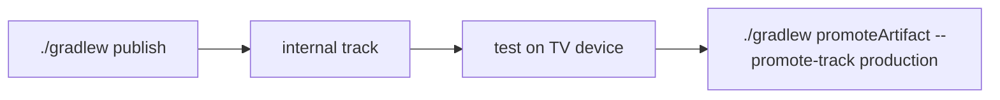

# Publishing to Google Play from Gradle

The app uses [Gradle Play Publisher](https://github.com/Triple-T/gradle-play-publisher) (GPP) so releases, store listing text, graphics, and release notes are all pushed from the command line — no Play Console UI clicking. Configuration lives in `app/build.gradle.kts` (`play {}` block); listing sources live in `app/src/main/play/`.

## One-time setup

### 1. Create the app record (Play Console, once ever)

GPP cannot create the app itself. In the Play Console: **Create app** → name "DX Ambient", App (not game), Free. Fill the one-time declarations when prompted (Data Safety: no data collected; content rating questionnaire; target audience). Opt in to the **Android TV** form factor under *Release → Advanced settings → Form factors*.

### 2. Create a service account and grant it access

1. Open [Google Cloud Console](https://console.cloud.google.com/) → create (or pick) a project.
2. **APIs & Services → Enable APIs** → enable **Google Play Android Developer API**.
3. **IAM & Admin → Service Accounts → Create service account** (name e.g. `play-publisher`). No project roles needed.
4. On the new account: **Keys → Add key → JSON** — save the downloaded file as `play-service-account.json` at the repo root (it is gitignored; never commit it).
5. In the **Play Console → Users and permissions → Invite new users** → enter the service account's email (`play-publisher@<project>.iam.gserviceaccount.com`) → under *App permissions* add DX Ambient → grant **Release to testing tracks, Release to production, Manage store presence** (or the "Release manager" permission set).

On CI, instead of the file, export the key's JSON content as the `ANDROID_PUBLISHER_CREDENTIALS` environment variable — GPP picks it up automatically.

### 3. Signing

Release signing already reads `keystore.properties` (local) or `DXA_*` env vars (CI). Publishing requires a properly signed bundle — if neither is configured the build silently falls back to the **debug** key and Play will reject the upload, so make sure `keystore.properties` is in place before publishing.

## Everyday commands

| Command | What it does |
|---------|--------------|
| `./gradlew publishBundle` | Build the release AAB and upload it to the configured track (default: **internal**) |
| `./gradlew publishListing` | Upload listing text + graphics from `app/src/main/play/` |
| `./gradlew publishProducts` | Upload in-app products (none yet) |
| `./gradlew publishApps` | Bundle + listing together (the aggregate task is `publishApps`, not `publish`) |
| `./gradlew promoteArtifact --from-track internal --promote-track production` | Promote the tested build to production |
| `./gradlew bootstrap` | Pull the current Play listing/graphics down into `app/src/main/play/` (useful to sync after any manual console edit) |

Useful flags (override the defaults from the `play {}` block per invocation):

```bash
./gradlew publishBundle --track production            # publish straight to production
./gradlew publishBundle --release-status draft        # upload as draft
./gradlew promoteArtifact --promote-track production --user-fraction 0.25   # staged rollout
```

## Defaults configured in `app/build.gradle.kts`

- **Track:** `internal` — safe default; promote to production explicitly.
- **`defaultToAppBundles = true`** — `publish*` builds an AAB, never an APK.
- **`resolutionStrategy = AUTO`** — the versionCode is automatically bumped past the highest one already on Play, so uploads never fail on a duplicate code (the local `versionCode` becomes a floor, not something you must remember to bump).
- **`releaseStatus = COMPLETED`** — releases go live on the track immediately on upload.

## Release flow



1. `./gradlew publishApps` — uploads the signed AAB + any listing changes to **internal**.
2. Install via the internal-testing opt-in link on a real TV device; sanity-check playback, SAF import, D-pad.
3. `./gradlew promoteArtifact --from-track internal --promote-track production` (add `--user-fraction` for a staged rollout).
4. Tag the release: `git tag v<versionName> && git push --tags`.

## Listing sources (`app/src/main/play/`)

```
play/
├── contact-email.txt / contact-website.txt / default-language.txt
├── listings/en-GB/   ← the listing locale on Play is en-GB (account default)
│   ├── title.txt                 (≤ 30 chars)
│   ├── short-description.txt     (≤ 80 chars)
│   ├── full-description.txt      (≤ 4000 chars)
│   └── graphics/                 (icon, feature-graphic, tv-banner, tv-screenshots, …)
└── release-notes/en-GB/default.txt   (≤ 500 chars, used for every track)
```

Edit these files, run `./gradlew publishListing`, done. Per-track release notes go in `release-notes/en-US/<track>.txt` if you ever need them.

> Note: the first artifact upload, Data Safety form, content rating, and TV form-factor opt-in are one-time console actions; everything after that (new builds, listing edits, promotions, release notes) flows through Gradle.

## Production access (personal account policy)

This developer account is subject to Google's closed-testing requirement for personal accounts: production and open testing stay locked until a closed test (alpha track) has run with **at least 12 opted-in testers for 14 consecutive days**, after which **Apply for production** on the Console dashboard becomes available. Until then `promoteReleaseArtifact --promote-track production` (or `beta`) returns `FAILED_PRECONDITION` — that is the policy gate, not a config error. Internal and alpha publishing work fully from Gradle.
