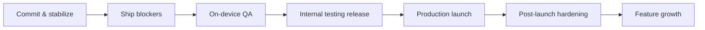

# DX Ambient — Production Roadmap

Status snapshot (audited 2026-06-10): all 10 MVP features implemented, 75/75 unit tests green, release signing wired, privacy policy written and ready to host, fastlane text metadata done. The items below are what stands between the current tree and a healthy production app on Google Play.

## M0 — Commit and stabilize the working tree ✅

- [x] Commit the touch/D-pad dual-input work as its own commit.
- [x] Commit release hardening + publishing setup separately.
- [x] Commit docs, the Play listing metadata (`app/src/main/play/`), and `web/` privacy page.
- [x] Verified `dx-ambient-upload.keystore`, `keystore.properties`, and `play-service-account.json` are untracked.
- [ ] Keep a secure offline backup of the upload keystore — losing it complicates the Play listing identity (mitigated by Play App Signing, but the upload key still matters). **(manual)**

## M1 — Ship blockers (Play Console will reject without these)

- [x] **Store graphics** — done: icon, feature graphic, TV banner, 4 TV screenshots and 3 phone screenshots live in `app/src/main/play/listings/en-GB/graphics/` and were uploaded to Play via `./gradlew publishListing`.
- [x] **Deploy the privacy policy** — live at `https://dimension-x.live/ambient/privacy/index.html` (use the full URL incl. `index.html`; the bare directory path returns 404).
- [x] **Fix the Room migration trap** — done: `exportSchema = true` with `core-data/schemas/` committed, destructive fallback removed, `AmbientDatabaseMigrations` scaffold wired into the builder.
- [x] **Version discipline** — handled: Gradle Play Publisher `resolutionStrategy = AUTO` bumps the versionCode past the highest one on Play at upload time.

## M2 — On-device QA (nothing has run on real hardware yet)

The README is explicit that UI behaviour, SAF/USB import, and the WebView path are unverified on device. Run on at least one real Android/Google TV device and one phone:

- [ ] Scene playback: both bundled scenes (Digital Campfire playlist, Space Odyssey loop), loop modes, separate-audio muting, mask overlay, brightness scrim, 900ms reveal fade.
- [ ] SAF import from internal storage and a USB drive; permission persistence across reboot; revoked-permission behaviour (currently fails silently — see M5).
- [ ] Sleep timer and auto-dim end-to-end, including overnight soak test on a projector (thermals, OOM, surface loss after HDMI sleep/wake).
- [ ] D-pad traversal of every screen plus the new touch bridge on a phone; overscan padding on TV.
- [x] Fix the known lifecycle bugs QA will likely surface — done:
  - `PlayerScreen` now pauses on ON_STOP and fully stops playback + timers on dispose; `PlayerViewModel.onCleared()` is a safety net for every exit path.
  - `AmbientPlayer` is released from `MainActivity.onDestroy` (when finishing) and transparently rebuilds its ExoPlayers on the next load.
- [ ] Run R8/release build QA specifically: install `:app:bundleRelease` output (via bundletool) and re-test serialization-backed flows (scene save/load) since minification is where kotlinx.serialization breaks.

## M3 — Internal testing release

- [x] Publish with `./gradlew publishReleaseApps` — done: v1.1.0 (versionCode 3) is live on the **internal** and **closed testing (alpha)** tracks with the full store listing.
- [ ] Complete Play Console declarations: Data Safety (no collection — matches the privacy policy), content rating, target audience, TV form-factor opt-in and TV review checklist.
- [ ] Let Play pre-launch report run on TV device profiles; triage every crash/ANR it finds.
- [x] Tag the release in git — done: `v1.1.0`.

## M4 — Production launch

- [ ] Promote from internal → production: **blocked by Google's personal-account policy** — needs 12 opted-in closed-test testers for 14 consecutive days, then "Apply for production" in the Console. Afterwards: `./gradlew promoteReleaseArtifact --from-track internal --promote-track production`. **(manual + waiting period)**
- [x] YouTube mode posture — superseded: real OAuth sign-in is configured (dimension-x-live Cloud project) and `YOUTUBE_MODE_ENABLED` is on; the demo playlist is removed.
- [ ] Verify the listing renders correctly on the TV store surface (banner, screenshots, description).

## M5 — Post-launch hardening

Observability — currently the app has zero crash reporting, so production failures are invisible:

- [ ] Add crash reporting consistent with the privacy policy (self-hosted GlitchTip/Sentry fits the "no third-party trackers" stance better than Crashlytics; update the privacy policy and Data Safety form if anything is added).
- [x] Surface errors that are currently swallowed — done: library import/remove/refresh failures show a dismissable message in the Library screen; default-scene seeding and SAF permission failures are logged; the YouTube JS `nextVideo` catch now reports unplayable instead of dying silently.

CI/CD — everything is manual today:

- [x] Add a pipeline — done: `.github/workflows/ci.yml` runs unit tests, lint, and `bundleRelease` on every push/PR, and publishes to the internal track on `v*` tags via `publishReleaseApps` (secrets: `DXA_*` + `ANDROID_PUBLISHER_CREDENTIALS`). **Activates once the repo gets a GitHub remote — none is configured yet.**
- [x] Commit `gradle-wrapper.jar` — was already tracked; the stale README note claiming otherwise is fixed.

Test depth:

- [ ] Add instrumented tests for the untested layers: Room DAO + migrations, SAF indexer, AmbientStage composition, navigation smoke test. `core-rendering` and `app` currently have zero tests.
- [ ] Add a Compose UI test for D-pad focus traversal on Home/Player (the highest-risk TV regression surface).

Robustness:

- [x] Validate persisted SAF URIs on read — done: import verifies the grant was actually persisted (user-visible error otherwise); refresh skips folders whose grant was revoked instead of aborting.
- [x] Handle scene `payloadJson` deserialization failures gracefully — done: corrupt rows are logged and dropped (`toDomainOrNull`), covered by unit tests.
- [ ] Consider a scene export/import (JSON) feature as a user-facing backup story.

## M6 — Feature growth (post-1.x)

- [x] **YouTube OAuth** — done: youtube.readonly sign-in via Play Services Authorization against the `dimension-x-live` project (Android clients for debug/upload/Play-signing certs + Web client ID in `youtube_config.xml`); demo playlist removed; IFrame-only policy unchanged. Note: the consent screen is in **Testing** mode (test users: dimensionxlive@, moaddib666@) — grants expire every 7 days until the app is published & verified for the sensitive scope.
- [ ] **Burn-in protection** — the `ProjectorSettings.burnInProtection` flag exists but no pixel-shift logic is implemented in rendering; implement subtle periodic image shift.
- [ ] **Resume-on-launch polish** — verify `resumeLastSceneOnLaunch` + `lastSceneId` works from a cold boot on TV (auto-start into the player).
- [ ] **True alpha compositing** — documented upgrade path in `AmbientStage.kt:35-36`: move masks/dim from Compose overlays to Media3 video effects (`OverlayEffect`) for correctness on HDR/tiered devices.
- [ ] **Jetpack TV foundation** — `tv-foundation 1.0.0-alpha12` is the only alpha dependency; migrate off it (or to its stable replacement) as the TV Compose stack stabilizes.
- [ ] More bundled scenes/masks; remote (CDN) scene catalog if the local-first stance permits an opt-in.
