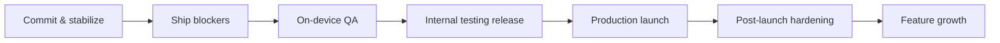

# DX Ambient — Production Roadmap

Status snapshot (audited 2026-06-10): all 10 MVP features implemented, 75/75 unit tests green, release signing wired, privacy policy written and ready to host, fastlane text metadata done. The items below are what stands between the current tree and a healthy production app on Google Play.

## M0 — Commit and stabilize the working tree

The repo has 12 modified files plus untracked `InputModes.kt`, `docs/`, `fastlane/`, `web/` carrying the entire release-hardening effort uncommitted.

- [ ] Commit the touch/D-pad dual-input work (`core-rendering/src/main/kotlin/com/dx/ambient/rendering/components/InputModes.kt` + `AmbientComponents.kt` + screen updates) as its own commit.
- [ ] Commit release hardening (`app/build.gradle.kts`, `proguard-rules.pro`, `AndroidManifest.xml`) separately.
- [ ] Commit docs, the Play listing metadata (`app/src/main/play/`), and `web/` privacy page.
- [ ] Verify `dx-ambient-upload.keystore` and `keystore.properties` remain untracked (`git ls-files | grep -i keystore` must be empty) and keep a secure offline backup of the keystore — losing it permanently locks the Play listing identity (mitigated by Play App Signing, but the upload key still matters).

## M1 — Ship blockers (Play Console will reject without these)

- [ ] **Store graphics** — the only hard listing blocker. Create in `app/src/main/play/listings/en-US/graphics/` per the README there: 512×512 icon, 1024×500 feature graphic, 1280×720 TV banner, and at least one TV screenshot at 1280×720 or 1920×1080 (capture via `adb exec-out screencap`). Upload with `./gradlew publishListing`.
- [ ] **Deploy the privacy policy** — `web/ambient/privacy/index.html` must actually be live at `https://dimension-x.live/ambient/privacy/` before submitting the Data Safety form.
- [ ] **Fix the Room migration trap** — `core-data/.../di/DataModule.kt:41` uses `fallbackToDestructiveMigration()` with `exportSchema = false`. Any future schema bump silently wipes all user scenes. Before v1 ships (and freezes schema v1 in the wild): set `exportSchema = true`, commit the schema JSON, remove the destructive fallback, and add a `Migration` scaffold so v1→v2 is additive. This is cheap now and irreversible-pain later.
- [ ] **Version discipline** — handled: Gradle Play Publisher is configured with `resolutionStrategy = AUTO`, so the versionCode is bumped past the highest one on Play automatically at upload time.

## M2 — On-device QA (nothing has run on real hardware yet)

The README is explicit that UI behaviour, SAF/USB import, and the WebView path are unverified on device. Run on at least one real Android/Google TV device and one phone:

- [ ] Scene playback: both bundled scenes (Digital Campfire playlist, Space Odyssey loop), loop modes, separate-audio muting, mask overlay, brightness scrim, 900ms reveal fade.
- [ ] SAF import from internal storage and a USB drive; permission persistence across reboot; revoked-permission behaviour (currently fails silently — see M5).
- [ ] Sleep timer and auto-dim end-to-end, including overnight soak test on a projector (thermals, OOM, surface loss after HDMI sleep/wake).
- [ ] D-pad traversal of every screen plus the new touch bridge on a phone; overscan padding on TV.
- [ ] Fix the known lifecycle bugs QA will likely surface:
  - `PlayerScreen.kt:58-61` — `viewModel.onStop()` only fires on explicit BACK; backgrounding/process-death paths can leak the sleep-timer and auto-dim jobs. Tie cleanup to lifecycle (`DisposableEffect`/`onCleared`).
  - `AmbientPlayer.kt:127-130` — singleton ExoPlayers are never lifecycle-released; verify no playback continues or surface leaks when the activity is destroyed.
- [ ] Run R8/release build QA specifically: install `:app:bundleRelease` output (via bundletool) and re-test serialization-backed flows (scene save/load) since minification is where kotlinx.serialization breaks.

## M3 — Internal testing release

- [ ] Publish with `./gradlew publish` (Gradle Play Publisher uploads the signed `.aab`, listing, and release notes to the **internal** track — see `docs/PUBLISHING.md`); requires the one-time service-account setup documented there.
- [ ] Complete Play Console declarations: Data Safety (no collection — matches the privacy policy), content rating, target audience, TV form-factor opt-in and TV review checklist.
- [ ] Let Play pre-launch report run on TV device profiles; triage every crash/ANR it finds.
- [ ] Tag the release in git (`v1.0.0`) and record the exact commit + mapping file.

## M4 — Production launch

- [ ] Promote from internal → production (optionally staged rollout).
- [ ] Decide YouTube mode posture for v1: it is gated behind TODO OAuth (`optional-youtube/.../YouTubeTabScreen.kt:46,66,140` with a hardcoded demo playlist). Recommended: ship v1 with the YouTube entry hidden/disabled rather than exposing the demo playlist, keeping the launch purely local-first.
- [ ] Verify the listing renders correctly on the TV store surface (banner, screenshots, description).

## M5 — Post-launch hardening

Observability — currently the app has zero crash reporting, so production failures are invisible:

- [ ] Add crash reporting consistent with the privacy policy (self-hosted GlitchTip/Sentry fits the "no third-party trackers" stance better than Crashlytics; update the privacy policy and Data Safety form if anything is added).
- [ ] Surface errors that are currently swallowed: library import failures (`LibraryViewModel.kt:56-61`), default-scene seeding (`BootViewModel.kt:39`), SAF permission loss (`SafMediaIndexer.kt:30,39`), and the empty JS catch in `YouTubeIFrameScreen.kt:358`. Each needs at minimum a log line, ideally a user-visible message.

CI/CD — everything is manual today:

- [ ] Add a pipeline (GitHub Actions or company Jenkins) running `testDebugUnitTest`, lint, and `assembleRelease` on every PR; signing via the existing `DXA_*` env-var fallback already supported in `app/build.gradle.kts`.
- [ ] Wire `./gradlew publish` into CI (credentials via `ANDROID_PUBLISHER_CREDENTIALS` env var) so releases are reproducible.
- [ ] Commit `gradle-wrapper.jar` or generate it in CI so builds don't depend on a local Gradle install.

Test depth:

- [ ] Add instrumented tests for the untested layers: Room DAO + migrations, SAF indexer, AmbientStage composition, navigation smoke test. `core-rendering` and `app` currently have zero tests.
- [ ] Add a Compose UI test for D-pad focus traversal on Home/Player (the highest-risk TV regression surface).

Robustness:

- [ ] Validate persisted SAF URIs on read and prompt re-grant when revoked.
- [ ] Handle scene `payloadJson` deserialization failures gracefully (corrupt row should not crash boot).
- [ ] Consider a scene export/import (JSON) feature as a user-facing backup story.

## M6 — Feature growth (post-1.x)

- [ ] **YouTube OAuth** — finish real sign-in + "my playlists" via Play Services Authorization, replacing the demo playlist; keep the IFrame-only, no-background-playback policy.
- [ ] **Burn-in protection** — the `ProjectorSettings.burnInProtection` flag exists but no pixel-shift logic is implemented in rendering; implement subtle periodic image shift.
- [ ] **Resume-on-launch polish** — verify `resumeLastSceneOnLaunch` + `lastSceneId` works from a cold boot on TV (auto-start into the player).
- [ ] **True alpha compositing** — documented upgrade path in `AmbientStage.kt:35-36`: move masks/dim from Compose overlays to Media3 video effects (`OverlayEffect`) for correctness on HDR/tiered devices.
- [ ] **Jetpack TV foundation** — `tv-foundation 1.0.0-alpha12` is the only alpha dependency; migrate off it (or to its stable replacement) as the TV Compose stack stabilizes.
- [ ] More bundled scenes/masks; remote (CDN) scene catalog if the local-first stance permits an opt-in.
